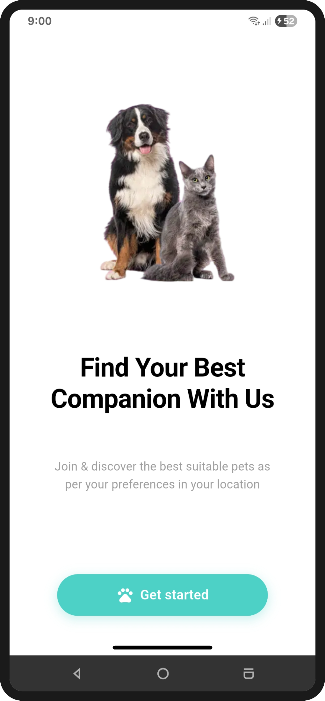
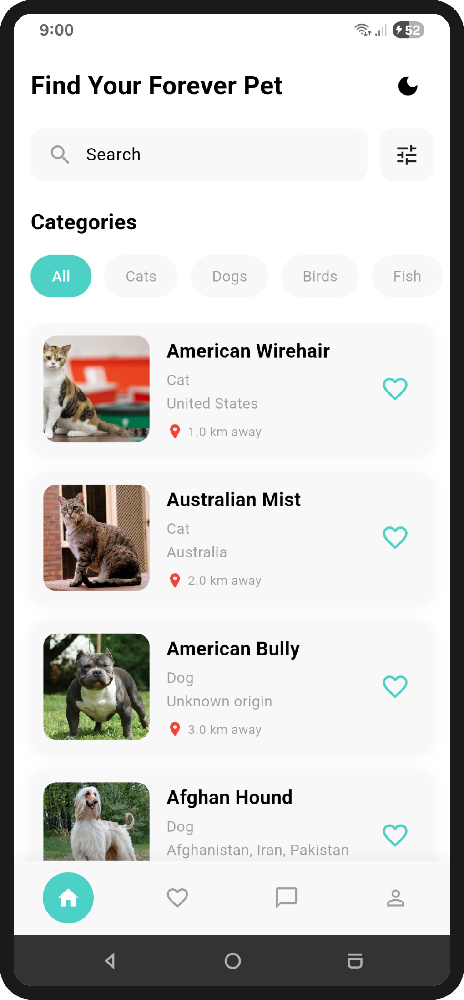
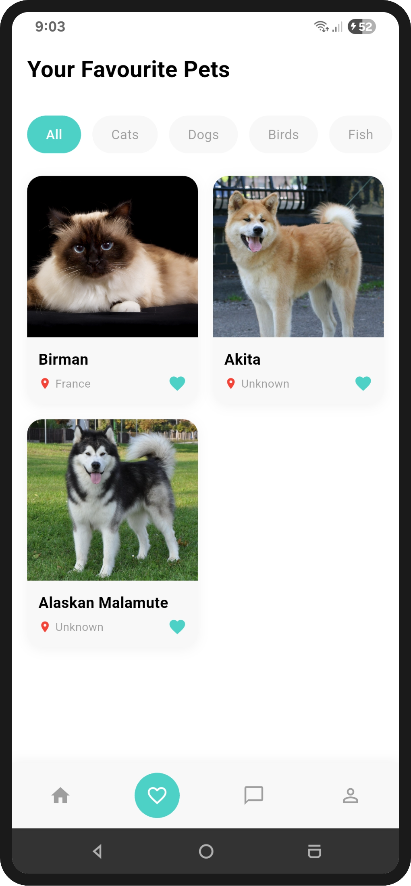
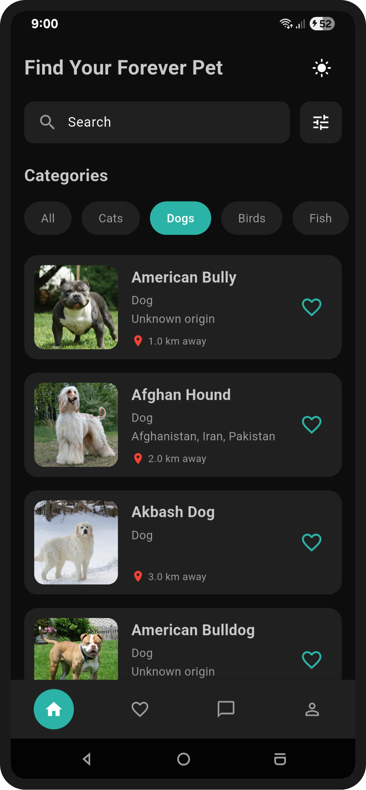
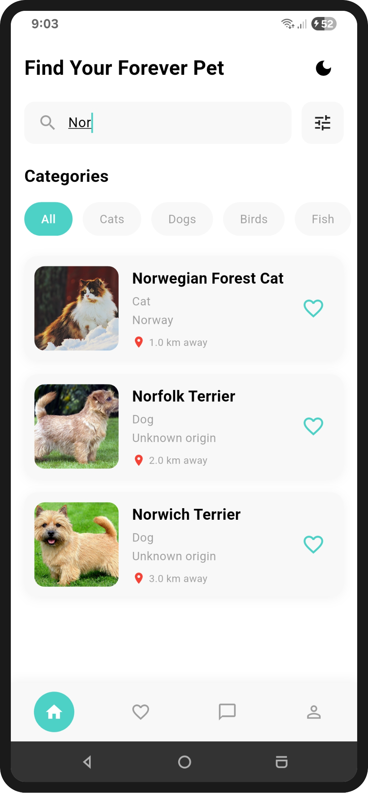
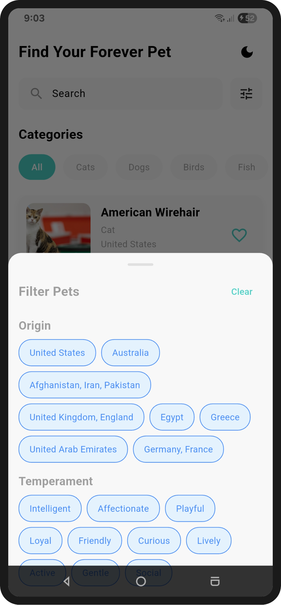

# 🐾 PetFinder App

A production-ready Flutter application for discovering and adopting pets. Built with Clean Architecture and modern Flutter best practices.

## 📋 Overview

PetFinder is a complete pet adoption platform that helps users find their perfect companion. The app features real-time pet browsing, advanced search and filtering, favorites management, and detailed pet profiles. Built with API integration and following clean architecture principles for maintainability and scalability.

## 🛠️ Tech Stack

- **Flutter** – Cross-platform mobile framework
- **Dio** – HTTP client for API integration
- **flutter_bloc (BLoC / Cubit)** – State management
- **get_it** – Dependency injection
- **Hive** – Local database & caching
- **hive_flutter** – Hive integration for Flutter
- **shared_preferences** – Lightweight local key-value storage
- **Firebase Core** – Firebase initialization
- **Firebase Crashlytics** – Crash reporting and monitoring
- **Firebase Analytics** – User analytics and event tracking
- **flutter_dotenv** – Environment variable management
- **flutter_native_splash** – Native splash screen generation

## 🏗️ Architecture

The app follows **Clean Architecture** with feature-first organization:

```
lib/
├── 🎯 core/                 # Shared utilities
│   ├── di/                   # Dependency injection
│   ├── network/              # API client setup
│   ├── routing/              # Navigation routes
│   ├── theming/              # Theme management
│   ├── utils/                # Helpers & constants
│   └── widgets/              # Reusable UI components
│
└── ✨ features/             # Feature modules
    │
    ├── 🏠 home/             # Pet Browsing & Search
    │   ├── data/            # API integration, local cache
    │   ├── domain/          # Business logic
    │   └── presentation/    # UI (BLoC + Screens)
    │
    ├── 📋 details/          # Pet Details
    │   ├── data/
    │   ├── domain/
    │   └── presentation/
    │
    ├── ❤️ favourites/       # Favorites Management
    │   ├── data/
    │   ├── domain/
    │   └── presentation/
    │
    └── 👋 onboarding/       # First-time Experience
```

Each feature follows **3-layer architecture**:
- **Data Layer**: API integration, local storage, models, repository implementations
- **Domain Layer**: Entities, repository contracts, use cases
- **Presentation Layer**: BLoC state management, screens, widgets

## ✨ Features

### 🏠 Pet Discovery
- Browse comprehensive list of adoptable pets
- Real-time data synchronization
- Infinite scrolling
- Category-based filtering

### 🔍 Search & Filter
- Search pets by name or breed
- Filter by type (Dogs, Cats, Rabbits, Birds)
- Advanced filtering options
- Quick category chips

### ❤️ Favorites Management
- Save favorite pets for later
- Quick access to saved pets
- Add/remove favorites
- Persistent favorites storage

### 📋 Pet Details
- Comprehensive pet information
- Photo galleries
- Age, breed, and description
- Adoption details and contact info

### 🎨 Theming
- Light and dark mode support
- System theme detection
- Persistent theme selection
- Smooth theme transitions

### 💾 Offline Support
- Local caching with Hive
- Access previously viewed pets offline
- Online/offline experience


## 📸 Screenshots
<p align="center">
  
  
  
</p>

<p align="center">
  
  
  
</p>


## 🎬Project Preview

[Youtube](https://www.youtube.com/shorts/mTaha-gZBic)

## 👤 Author

[@marwa-eltayeb](https://github.com/marwa-eltayeb)

